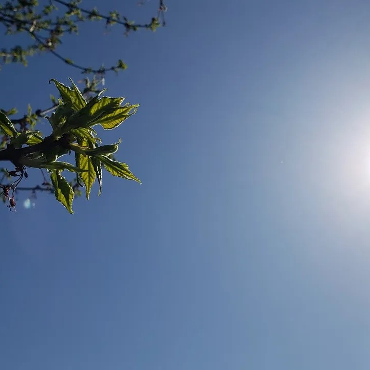

For my senior thesis, I compared parameterized and line-by-line model output from experimental protocol outlined by the CMIP6 Radiative Forcing Model Intercomparison Proect (RFMIP). The purpose of this was to understand how well the parameterized radiation models that are incorporated in Global Climate Models (GCMs) quantify the radiative energy balance of the atmosphere. 

In order to increase efficiency and reduce cost, parameterized models approximate the emission spectra of atmospheric gases to minimize the calculations necessary to compute atmospheric radiation levels. In my thesis, parameterized models were compared to 'line-by-line' models that fully evaluate emission spectra of atmospheric gases to understand the magnitude and sources of error arising from the parameterization of emission spectra. I focused specifically on this parameterization error under a variety of atmospheric CO2 concentrations, ranging from pre-industrial to 8x modern-day CO2 scenarios.

Here is some example code to illustrate Simple Schema use:


 
Source: <a href="https://github.com/theVacay/vacay">theVacay/vacay</a>
